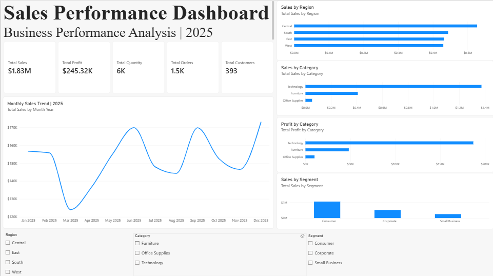
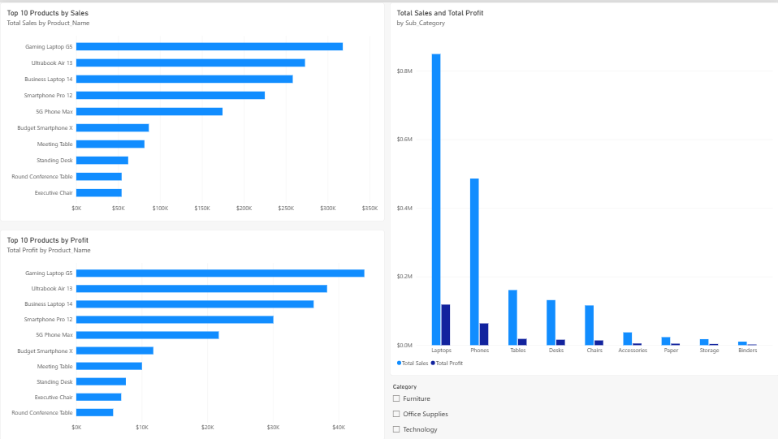
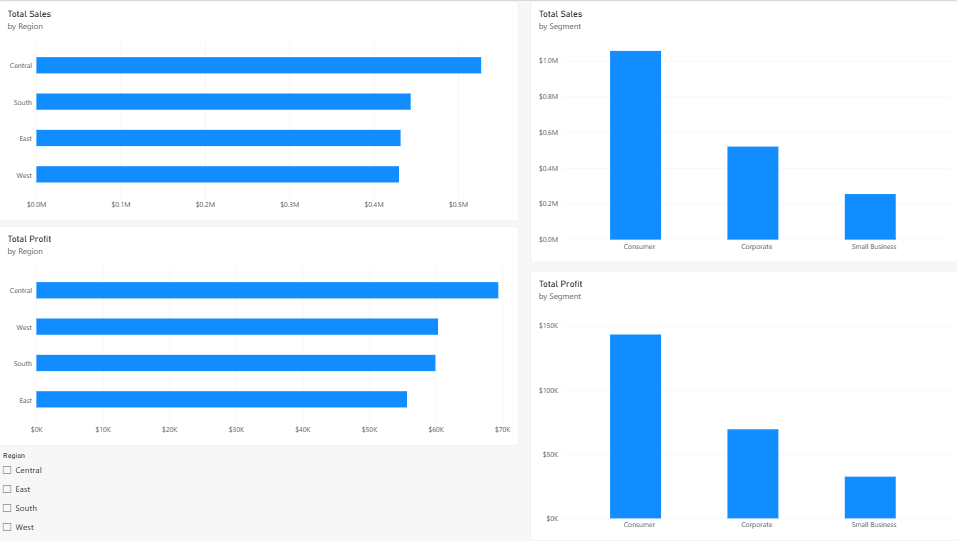

# Sales Performance Dashboard

## Overview

This project presents an interactive Power BI dashboard developed to analyze business sales performance across products, categories, regions, customer segments, and time.

The dashboard demonstrates a data analytics workflow including data preparation, data modeling, DAX measures, data visualization, and business insight generation.

## Business Objectives

The dashboard was developed to:

- Monitor key sales and profitability KPIs
- Analyze monthly sales trends
- Compare sales performance across regions
- Analyze category and customer segment performance
- Identify high-performing products
- Support data-driven business analysis

## Dataset

The dataset contains **1,500 sales transactions** from 2025.

Key fields include:

- Order Date
- Customer
- Region
- Segment
- Category
- Sub-Category
- Product
- Sales
- Quantity
- Discount
- Profit

## Tools & Technologies

- **Power BI**
- **Power Query**
- **DAX**
- **CSV**
- **Data Visualization**
- **Business Analysis**

## Dashboard

### 1. Overview

The Overview page provides a high-level summary of business performance through key performance indicators and visual analysis.

It includes:

- Total Sales
- Total Profit
- Total Orders
- Total Customers
- Monthly Sales Trend
- Sales by Region
- Sales by Category
- Profit by Category
- Sales by Customer Segment

### 2. Product Analysis

The Product Analysis page focuses on product-level performance and helps analyze products and sub-categories based on sales and profitability.

### 3. Regional Analysis

The Regional Analysis page compares sales and profitability across regions and customer segments.

## Key Results

The dashboard summarizes the following overall performance indicators:

| KPI | Result |
|---|---:|
| Total Sales | **$1.83M** |
| Total Profit | **$245.32K** |
| Total Orders | **1,500** |
| Total Customers | **393** |
| Profit Margin | **13.39%** |
| Average Order Value | **$1,221.56** |

## Data Analysis Process

### 1. Data Preparation

The dataset was prepared and validated using Power Query before being used for analysis and visualization.

### 2. Data Modeling

A dedicated Date Table was created to support time-based analysis and connected to the sales transaction table through the Order Date field.

### 3. DAX Measures

Several measures were created to calculate key business metrics, including:

- Total Sales
- Total Profit
- Total Quantity
- Total Orders
- Total Customers
- Profit Margin
- Average Order Value

### 4. Data Visualization

The dashboard uses KPI cards, line charts, bar charts, column charts, and slicers to provide interactive analysis across different business dimensions.

## Business Insights

The dashboard enables analysis of:

- Monthly sales trends
- Regional sales and profitability
- Category and sub-category performance
- Customer segment performance
- Product-level sales and profit
- Overall sales and profitability KPIs

These analyses can support business performance monitoring and identify areas requiring further investigation.

## Skills Demonstrated

- Data Cleaning
- Data Transformation
- Data Validation
- Data Modeling
- DAX
- Power BI
- Power Query
- Data Visualization
- Business Analysis
- KPI Monitoring
- Insight Communication

## Project Files

| File | Description |
|---|---|
| `sales_performance_dashboard_dataset.csv` | Dataset containing 1,500 sales transactions |
| `Sales_Performance_Dashboard.pbix` | Power BI dashboard file |
| `overview.png` | Overview dashboard screenshot |
| `product-analysis.png` | Product Analysis dashboard screenshot |
| `regional-analysis.png` | Regional Analysis dashboard screenshot |

## Author

**Izzatul Al Nabila**

Teknik Informatics Student | Aspiring Data Analyst
